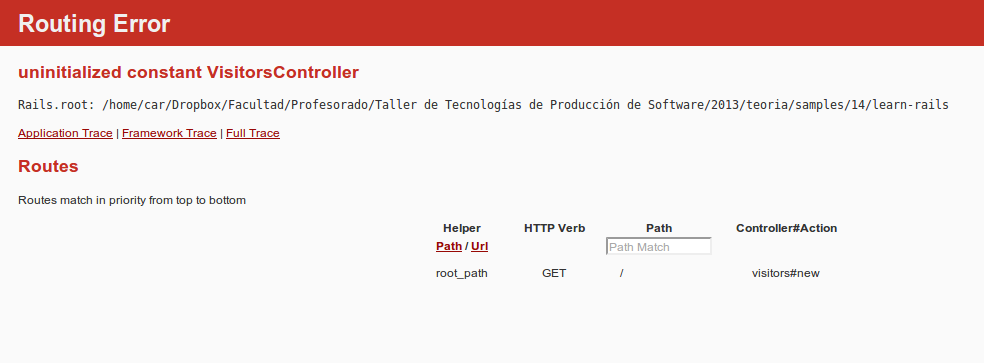

***

# Rails
---
## Cómo funciona la web
* Contenidos: HTML, imagenes, CSS, JS
* Contenidos estáticos
* Contenidos dinámicos
  * Porque se conecta a una DB / Servicio (Facebook)
  * Para simplificar el armado de un HTML modularizando el armado (partials)

---
## Qué es rails
* Conjunto de estructuras y convenciones
* Es una librería o conjunto de gemas
* Al usar rails,  estaremos usando prácticas estandar que simplificarán la
  colaboración y el mantenimiento del código
* Promueve [Separation of Concerns (SoC)](http://en.wikipedia.org/wiki/Separation_of_concerns), lo cual permite obtener programas modulares y mantenibles
* El principal patrón de diseño que implementa es MVC

---
## Stacks

Un stack es un conjunto de tecnologías o librerías utilizadas para desarrollar
una aplicación o para servir una página

* Facebook usa algo como:
    * Linux (operating system)
    * Apache (web server)
    * MySQL (database)
    * PHP (programming language)
* Para el desarrollo con rails generalmente es:
    * Mac OS X, Linux, or Windows
    * WEBrick (web server)
    * SQLite (database)
    * Ruby on Rails (language and framework)

---
## Componentes y alternativas
* Un clásico stack de rails será:
  * ERB for view templates
  * MySQL for databases
  * MiniTest for testing
* Una alternativa:
  * Haml for view templates
  * PostgreSQL for databases
  * Rspec for testing

<small>
Las componentes podrán intercambiarse fácilmente, habiendo múltiples
alternativas. Seguir las tendencias o componentes populares es una buena
elección
</small>

---
## Ayuda

¿Cómo obtener ayuda?

* Google: pero considerar resultados actuales
* [Stack Overflow](http://stackoverflow.com/questions/tagged/ruby-on-rails)
* [Rails Guides](http://guides.rubyonrails.org/)
* [Rails Documentation](http://api.rubyonrails.org/)
* [Rails Begginer Chat Sheet](http://pragtob.github.io/rails-beginner-cheatsheet/index.html)
* [Railscasts](http://railscasts.com/)
---
## Mantenerse actualizado

* [Ruby Weekly](http://rubyweekly.com/)
* [Ruby Flow](http://www.rubyflow.com/)
* [Ruby5](http://ruby5.envylabs.com/)

---
## Instalando

```bash

$ gem install rails
Successfully installed rails-x.y.z

$ rails -v
Rails x.y.z

```
---
## Exploramos el comando rails new

* Es importante saber que disponemos de mensajes de ayuda para cada comando
  rails
* Rails provee el comando `rails new` para crear una aplicación Rails básica

### Veamos la ayuda disponible para rails new:

```bash

$ rails new --help

```

<small>
<ul>
  <li>La ayuda puede parecer un tanto críptica a primera vista, pero es importante
      leer las opciones para ver qué alternativas tenemos.</li>
  <li>No usaremos ninguna opción en esta primer instancia</li>
  <li>Como resultado de la ejecución, se creará un directorio con carpetas y
      archivos en ella.</li>
</ul>

</small>

---
## Creamos nuestra primer aplicación

Primero creamos nuestra aplicación

```bash

$ rails new learn-rails

```

<small>
El parámetro **learn-rails** indica el nombre del proyecto. Puede usarse
cualquier nombre
</small>

Se instalarán varias gemas nuevas usando `bundler`

```bash

$ cd learn-rails && bundle

```

---
## Probando la nueva aplicación

Con los pasos anteriores hemos creado una aplicación simple con valores por
defecto que ya puede usarse

### Iniciando el servidor web

<small>
Es posible iniciar la aplicación usando `rails server` o `rails s`
</smal>

```bash

$ bundle exec rails s
... Could not find a JavaScript runtime....

```

<small>
Para solucionar este error debe instalarse **nodejs** o agregar la gema
**therubyracer** al `Gemfile` (notar que ya está pero comentada)
</small>

---
## Iniciando el web server

```bash
$ bundle exec rails s
=> Booting WEBrick
=> Rails 4.0.1 application starting in development on http://0.0.0.0:3000
=> Run `rails server -h` for more startup options
=> Ctrl-C to shutdown server
[2013-11-30 19:41:53] INFO  WEBrick 1.3.1
[2013-11-30 19:41:53] INFO  ruby 2.0.0 (2013-06-27) [x86_64-linux]
[2013-11-30 19:41:53] INFO  WEBrick::HTTPServer#start: pid=15338 port=3000
```

* Visualizamos la aplicación accediendo a [http://localhost:3000](http://localhost:3000)
* Observar que al usar el navegador, la consola donde se inició el web server
  se actualiza con información
  * Estos mismos mensajes se van almacenando en `log/development.log`
---
## Parando el web server
* El web server puede pararse con **Control+C**
* No es necesario reiniciar el servidor en caso de modificar el proyecto
* Los casos que requiere reiniciar son: 
	* Cuando se cambia el `Gemfile`
	* Al cambiar archivos de configuración 

---
## La estructura del proyecto

Carpetas y archivos importantes

<table>
  <tr>
    <td>Gemfile</td>
    <td> Lists all the gems used by the application.</td>
  </tr>
  <tr>
    <td>Gemfile.lock</td>
    <td>Lists gem versions and dependencies.</td>
  <tr>
    <td>README.rdoc</td>
    <td>A page for documentation.</td>
  <tr>
    <td>app/</td>
    <td>Application folders and files.</td>
  </tr>
  <tr>
    <td>config/ </td>
    <td>Configuration folders and files.</td>
  </tr>
  <tr>
    <td>db/ </td>
    <td>Database folders and files.</td>
  </tr>
  <tr>
    <td>public/ </td>
    <td>Files for web pages that do not contain Ruby code, such as error
pages.</td>
  </tr>
</table>

---
## Carpetas y archivos no tan importantes

<small>
No son importantes cuando estamos aprendiendo rails...
</small>

<table>
  <tr>
    <td>Rakefile</td>
    <td>Directives for the Rake utility program.</td>
  </tr>
  <tr>
    <td>bin/ </td>
    <td>Folder for binary (executable) programs.</td>
  </tr>
  <tr>
    <td>config.ru </td>
    <td>Configuration file for Rack (a software library for web servers).</td>
  </tr>
  <tr>
    <td>lib/</td> 
    <td>Folder for miscellaneous Ruby code.</td>
  </tr>
  <tr>
    <td>log/ </td>
    <td>Folder for application server logfiles.</td>
  </tr>
  <tr>
    <td>tmp/ </td>
    <td>Temporary files created when your application is running.</td>
  </tr>
  <tr>
    <td>vendor/ </td>
    <td>Folder for Ruby software libraries that are not gems.</td>
  </tr>
</table>

---
## El directorio app/

* Si listamos el contenido del directorio, nos encontramos con seis carpetas que
  estarán presentes en todo proyecto rails:
  * assets
  * channels
  * **controllers**
  * helpers
  * jobs
  * mailers
  * **models**
  * **views**

---
## El directorio app/
* Aquí se hace evidente el patrón *model view controller*
* La carpeta `mailers/` contempla código para el envío de mails
* La carpeta `helpers/` contiene *view helpers*, que son pequeñas porciones de
  código reusable que generan HTML. Podríamos definirnos como macros que
  expanden un pequeño comando en strings más extensos de tags HTML y contenido
* La carpeta `assets/` contiene estilos CSS y Javascripts que son procesados
  por *sprockets*
* La carpeta `channels/` contiene código de websockets
* La carpeta `jobs/` contiene tareas asíncronas
---
## Las Gemas de Rails
* Rails en sí es una gema que, de hecho, requiere un conjunto de otras gemas
  * Esto puede verse en
    [Rubygems](https://rubygems.org/gems/rails)
* Las gemas en que depende rails son:
  * [actionmailer](https://github.com/rails/rails/tree/master/actionmailer) - framework para envío de email y testing
  * [actionpack](https://github.com/rails/rails/tree/master/actionpack) - framework para el ruteo y respuestas a requerimientos WEB. *Es el VC de MVC*
  * [actionview](https://github.com/rails/rails/tree/master/actionview) - framework para el manejo de templates y renderizado. *Es el V de MVC*
---
## Las Gemas de Rails
* Las gemas en que depende rails son:
  * [activerecord](https://github.com/rails/rails/tree/master/activerecord) - framework para la conexión a bases de datos. *Es el M de MVC*
  * [activeresource](https://github.com/rails/activeresource) - framework para la abstracción de servicios REST. *Es el M' de MVC*
  * [activesupport](https://github.com/rails/rails/tree/master/activesupport) - extensiones a Ruby y clases que proveen mayor funcionalidad
  * [bundler](http://gembundler.com/) - Manejo de gemas
  * [railties](https://github.com/rails/rails/tree/master/railties) - comandos de consola y generadores

<small>
Estas gemas a su vez tienen dependencias, dando un total de aproximadamente 44
gemas
</small>

---
## Más gemas
* Además de la gema de rails, el comando `rails new` agrega otras gemas:
  * [sqlite3](https://github.com/luislavena/sqlite3-ruby) - adaptador para bases de datos SQLite
  * [sass-rails](https://github.com/rails/sass-rails) - habilita el uso de sintaxis SCSS para los estilos
  * [uglifier](https://github.com/lautis/uglifier) - compresor de JavaScript
  * [coffee-rails](https://github.com/rails/coffee-rails) - habilita el uso de sintaxis CoffeeScript para JavaScript
  * [turbolinks](https://github.com/rails/turbolinks) - técnica que acelera la carga de páginas web
  * [jbuilder](https://github.com/rails/jbuilder) - utilidad para la codificacion de datos en JSON
  * ~~[jquery-rails](https://github.com/rails/jquery-rails) - agrega la librería JavaScript jQuery~~

<small>
Puede que no se utilice ni SQLite, SCSS, jQuery u otras gemas, pero la mayoría
de los desarrollos las utilizan y por ello se consideran
</small>

---
## Algunas gemas útiles

De propósito general

* [high_voltage](https://github.com/thoughtbot/high_voltage) - Para la creación de páginas estáticas como *about*
* [figaro](https://github.com/laserlemon/figaro) - Para la configuracion del
  proyecto
* [simple_form](https://github.com/plataformatec/simple_form) - simplifica el uso de forms
* [ransack](https://github.com/activerecord-hackery/ransack) - busquedas
  simples
* [kaminari](https://github.com/amatsuda/kaminari) - pager de modelos
* [responders](https://github.com/plataformatec/responders) - código más
  limpio en los controladores
---
## Más gemas útiles
Para mejorar el estilo visual

* [bootstrap-sass](https://github.com/twbs/bootstrap-sass) - Bootstrap 3 con Sass
* [bootstrap](https://github.com/twbs/bootstrap-rubygem) - Bootstrap 4 con Sass
* [compass-rails](https://github.com/Compass/compass-rails) - simplifica el manejo de estilos para poder usar [Zurb Fundation](http://foundation.zurb.com/) por ejemplo
* [zurb-foundation](https://github.com/zurb/foundation-rails) - Fundation on
  rails projects
* [web-console](https://github.com/rails/web-console) - simplifica la búsqueda de errores
* [rails_layout](https://github.com/RailsApps/rails_layout) - genera archivos para el layout de la aplicación usando Twitter Bootstrap o Zurb Fundation

---
## Más gemas útiles

Para simplificar la labor de desarrollo

* [lograge](https://github.com/roidrage/lograge) - normaliza los logs
* [devise](https://github.com/roidrage/lograge) - autenticación
* [cancancan](https://github.com/CanCanCommunity/cancancan) - autorización
* [sidekiq](https://github.com/mperham/sidekiq) - tareas asíncronas
* [capistrano](http://capistranorb.com/) - despliegue automatizado
* ~~[quiet_assets](https://github.com/evrone/quiet_assets) - elimina mensajes
  que distraen en los logs~~
---
## Configuraciones
* Rails es conocido por su lema: **convention over configuration**
  * Al aplicarlo, se reducen muchas configuraciones
  * No todas las configuraciones pueden eliminarse
  * Las aplicaciones requieren credenciales o API keys para poder funcionar
* El versionado con **git** debe evitar el guardado de estas credenciales
---
## Configuraciones
* Una buena práctica para configurar estos datos es usar variables de entorno
  dado que:
  * La soportan todos SO como Windows, Mac y Linux, así como Heroku y otras
    plataformas de deployment
      * Hoy muy usado en docker 
  * Las variables de ambiente pueden accederse desde ruby
  * Mantienen la privacidad del proyecto de forma independiente
  * La gema **[figaro](https://github.com/laserlemon/figaro)** permite setear
    variables desde el shell o desde un archivo de configuración
  * La gema **[dotenv-rails](https://github.com/bkeepers/dotenv)** permite setear
    variables desde un archivo `.env` en `ENV`

---
## Cómo usar las variables de entorno

* Las variables de entorno se usan mediante la constante **ENV**. 
* Supongamos que se necesita configurar en alguna parte de nuestra aplicación
  rails, un servidor de mail


```ruby
config.action_mailer.smtp_settings = {
  address: "smtp.gmail.com",
  port: 587,
  domain: ENV["DOMAIN_NAME"],
  authentication: "plain",
  enable_starttls_auto: true,
  user_name: ENV["GMAIL_USERNAME"],
  password: ENV["GMAIL_PASSWORD"]
}
```

<small>
¿De qué forma seteamos los valores **DOMAIN_NAME**, **GMAIL_USERNAME** y **GMAIL_PASSWORD**?
</small>

---
## Como setear las variables con figaro

Agregamos al `Gemfile`

```ruby
gem 'figaro'
```

Instalamos la gema con bundler

```bash
$ bundle install
...
Using rails (4.0.1) 
Installing figaro (0.7.0) 
Using jbuilder (1.5.2) 
...
```


---
## Usando figaro
* Esta gema setea las variables de entorno antes de hacer cualquier otra cosa
* Los valores se leen desde un archivo: `config/application.yml`
* La gema entra en acción cuando se ejecute: `bundle exec figaro install`
* Al instalar figaro, se crea el archivo `config/application.yml` y apendea al
  `.gitignore` que se ignore esta configuracion
  * *De esta forma, los valores quedarán privados y no en el repositorio de git*

---
## Usando figaro

Instalando figaro

```bash
$ bundle exec figaro install
    create  config/application.yml
    append  .gitignore
```

Editamos `config/application.yml`

```yaml
GMAIL_USERNAME: mygmailusername
GMAIL_PASSWORD: mygmailpassword
development:
  GMAIL_USERNAME: otherusername
  GMAIL_PASSWORD: otherpassword
```

<small>
*Podemos setear las variables según el entorno*
<br />**Ojo con spring!**
</small>

---
## Páginas estáticas y ruteo
* Una aplicación rails puede servir páginas estáticas como cualquier web server
* Estas páginas no contienen código ruby
  * Esto hace que se sirvan de forma más rápida y usando menos recursos
* Empezar por crear páginas estáticas nos ayudará a entender el ruteo en rails

---
## Agregamos la home page

* Nos aseguramos tener iniciado el server rails: `bundle exec rails s`
* Ingresamos a [http://localhost:3000/](http://localhost:3000/)
  * Veremos la página de información por defecto de rails

**Creemos el archivo `public/index.html`**

```html

<h1> Hello World </h1>

```

<small>
<ul>
<li>Actualizamos la página y...</li>
<li>rails observará los cambios de la carpeta `public/`</li>
<li>Si no se especifica ningun archivo en la URL, se asume **index.html**
  <ul>
  <li>La razón de este hecho data de 1993 con la creación del primer web server</li>
  </ul>
</li>

</ul>
</small>

---
## Error de ruteo

<small>
¿Qué sucede si accedemos a [http://localhost:3000/about.html](http://localhost:3000/about.html)?
</small>


---
## Agregamos public/about.html

```html

<h1> About </h1>

```

*Ahora todo debería funcionar bien*

---
# Ruteo
---
## Introduciendo el ruteo
* El principio de *convention over configuration* gobierna el ruteo en rails
* Si un navegador solicita **index.html** entonces Rails servirá la página desde
  el directorio `public/` por defecto
	* No se necesita configuración para ello
* ¿Si queremos cambiar este comportamiento?
	* Haremos que la home page sea ahora el about
	* Debemos **eliminar** public/index.html: `rm public/index.html`

---
## Editamos config/routes.rb

```ruby
LearnRails::Application.routes.draw do
  root to: redirect('/about.html')
end
```

---
# Una reflexión
* El caso anterior es un ejemplo de la *magia de rails* 
* Algunos desarrolladores consideran que *convention over configuration* es
  **magia negra**
* No es obvio el por qué las páginas se sirven de `public/`
* Si se desconoce esta convención, podemos rompernos la cabeza buscando donde se
  mapea que http://localhost:3000 sirva `public/index.html`
	* El código que implementa esto, está enterrado profundamente en el corazón de
	  rails
---
## Request & response
* Analizaremos el patron MVC desde la perspectiva de la web
* Debemos considerar que la WEB no es más que navegadores que solicitan páginas
  a un servidor
* Los navegadores realizan **requerimientos** (request)
---
## Request & response
* Los servidores **responden** (response) a estos requerimientos, enviando, por ejemplo, un
  HTML.
  * Dependiendo en los encabezados del HTML, el navegador deberá realizar más
    requerimientos para obtener estilos, javascripts e imagenes
* La simplicidad de HTTP hace que no haya más que los requerimientos de un
  navegador y las respuestas de un servidor
  * Hoy día existe además el streaming de audio/video que requieren un pipe
    entre el navegador y el servidor, pero aún así, un requerimiento y respuesta inicial 
    hacen posible la incialización del stream

---
## El ciclo request / response


---
## Analizando el ciclo desde el navegador
* Es aconsejable usar [Google Chrome](https://www.google.com/chrome)
* Antes de investigar algo, es conveniente utilizar el **modo incógnito**: que
  se accede usando **Shift+Ctrl+N** (**Shift+Ctrl+P** en Firefox)
  * Alternativamente puede limpiarse la caché del navegador para así limpiar
    cualquier solicitud previamente cacheada por el navegador 
* Abrimos la vista *Developer Tools* usando **Shift+Ctrl+I**
  * Seleccionamos el tab **Network**
  * Realizamos el requerimiento [http://localhost:3000/about.html](http://localhost:3000/about.html)
  * Visualizaremos los archivos recibidos desde el servidor: sólo uno
    **about.html**
---
## Analizando el ciclo desde el navegador

Así debe verse el requerimiento


---
## Analizando el ciclo desde el navegador

Notar cuando no es "fresco" el requerimineto


---
## El detalle del requerimiento

<small>
Cliqueando sobre el nombre del archivo, y luego sobre la solapa **Headers**, se visualiza el detalle del requerimiento y su respuesta
</small>


---
## Analizamos lo que muestra el navegador
* Que el requerimiento se compone de:
  * Un request a la URL http://localhost:3000/about.html 
  * Que el método HTTP empleado fue GET
  * Los headers del request incluyendo cookies y el identificador del UA
* La respuesta se compone de:
  * El código de estado: 200 OK o 304 Not modified
  * Los headers de la respuesta: incluyendo fecha y hora, así como el
    identificador del servidor
  * HTML

<small>
Ahora podemos analizar cómo el requerimiento a **http://localhost:3000/**
devuelve dos entradas por el redirect
</small>

---
## Analizamos ahora desde el lado del servidor
* Hasta ahora vimos las herramientas que disponemos desde el navegador
  * Pero no podemos visualizar qué es lo que sucede en el servidor

**La ventana de consola del servidor muestra:**

```bash

Started GET "/" for 127.0.0.1 at ...

```

<small>
Es importante destacar que no hay logs para los archivos servidos desde la
carpeta `public/`
</small>

---
# Model View Controller
---
## MVC en la web

El siguiente gráfico muestra qué sucede en el servidor durante el ciclo
request-response 


<small>
Algunos expertos opinan que la arquitectura de la web no se ajusta al original
diseño de MVC creado para aplicaciones visuales de escritorio
</small>
---
## MVC en rails


---
## MVC en rails
* En la base del stack está el navegador: el requerimiento fluye subiendo por
  las capas hasta llegar al **router** que despachará al controlador apropiado
* Existe un único `config/routes.rb` y múltiples controladores, modelos y vistas
* El controlador, al recibir el flujo, obtendrá datos de algún **modelo**
* Con los datos listos, el controlador renderizará la respuesta combinando los
  datos del modelo con una componente de **vista** que provea layout y markup

---
## MVC en rails
* Los archivos del model, controller y view serán código ruby
* Cada archivo tendrá una estructura y sintaxis específica basada en cómo se ha
  definido por el mismo framework
* Cada model, view y controller que creemos *heradará* comportamiento de
  superclases que son parte del farmework, minimizando lo que debemos codificar

---
## Models en Rails
* En la mayor parte de las aplicaciones rails, un modelo obtiene datos de una base de datos
* Sin embargo, en otros casos se obtienen de conexiones a otros servidores
* Ejemplos:
  * El model **User** podría obtener el nombre y email desde una base de datos
    local
  * El mismo modelo, podría además obtener los tweets recientes de Twitter para
    este mismo usuario, o la ciudad en la que vive desde Facebook
---
## Controllers en Rails
* Un controlador podría obtener datos de más de un modelo si fuera necesario
* Generalmente un controlador posee más de una **acción**.
  Por ejemplo, un controlador para User podría tener acciones para listar los
usuarios, agregar o eliminar un usuario de la lista
* El archivo `config/routes.rb` macheará el requermiento web a una acción del
  controlador
* En Rails se trata de limitar las acciones en un controlador a las siete
  acciones siguientes: `index`, `show`, `new`, `create`, `edit`, `update` y
`destroy`
  * Un controlador que implementa estas acciones se dice que es **RESTful**

---
## Views en Rails
* Una vista combina código ruby con markup HTML. 
* Generalmente tendremos una vista asociada a cada acción de un controlador
  * Una vista para **index** debería mostrar una lista de usuarios
  * La vista **show** proveerá detalles del perfil de un usuario
---
## Views en Rails
* Las vistas tendrán una sintaxis muy similar a HTML convencional, pero con
  algunos datos que se extraen de variables ruby o estructuras de control como
loops que permitirán crear tablas.
  * Siguiendo el principio de Separation of Concerns, es considerada una buena práctica limitar el
uso de código ruby en las vistas a sólo utilizarlo para imprimir valores de
variables.
  * Cualquier otra cosa será responsabilidad del modelo
* No todas las acciones tendrán una vista: por ejemplo la acción **destroy**
  usualmente redirige al **index**, y **create** redirige o al **show** o al
**new**
---
## Home dinámica
*Planificamos nuestro trabajo definiendo un User story*

**Birthday countdown**

* As a visitor to the website
  * I want to see the owner's name
  * I want to see the owner's birthdate
  * I want to see how many days until the 
  *   owner's next birthday
  * In order to send birthday greetings

---
## La elección de nombres
* Mucho en el arte de la programación radica en elegir nombres correctos para
  nuestras creaciones
* Necesitamos un modelo que represente el site owner. 
  * Elegiremos el nombre más obvio: **Owner** y cremos el archivo
`app/models/owner.rb`
* El nombre del controlador abre otro debate
  * Nos podríamos tentar por *Home controller* o *Welcome controller*
  * Si bien son nombres aceptables, si consideramos el **User Story** el nombre
    **Visitors controller** es más adecuado porque **visitor** es el actor
  * Creamos entonces `app/controllers/visitors_controller.rb`

---
## Convenciones de nombres
* En rails es importante como se llaman los archivos y clases definidas en
  ellos.
* Esto se debe al principio CoC
* Esto evita configuraciones innecesarias
* Al escribir código
  * `class Visitor < ActiveRecord::Base` *los nombres de las clases de modelo
    son en singular y en mayúscula*
  * `class VisitorsController < ApplicationController` *los nombres de
    controladores son la combinación de un nombre de modelo en plural con
    __Controller__ en camel case*
---
## Convenciones de nombres
* Los archivos:
  * Los archivos de modelo coinciden con el nombre del modelo , pero en
    minúscula: `app/models/visitor.rb`
  * Los archvios de controlador coinciden con la clase, pero usando snake case:
  `app/controllers/visitors_controller.rb`
  * La carpeta de las vistas coinciden con el nombre de la clase del modelo,
    pero en plural y en minúscula: `app/views/visitors`

---
## Routing
Crearemos primero el ruteo antes de implementar el model y controller

### Editamos config/routes.rb

```ruby
LearnRails::Application.routes.draw do
  root to: 'visitors#new'
end
```

* Notar el modulo **LearnRails** como prefijo
	* Esto se debe al nombre de la aplicación que creamos con el comando `rails
	  new learn_rails`
* Los detalles de la sintaxis de este archivo puede 
  entenderse bien leyendo [Routing from outside in](http://guides.rubyonrails.org/routing.html)
* Modificando `config/routes.rb` no requiere reiniciar

---
## Probamos http://localhost:3000

Esperamos obtener un error



El error es claro: **uninitialized constant VisitorsController** indicando que
Rails busca la clase y no puede encontrarla

<small>
Podemos mejorar el error agregando la gema `better_errors` al `Gemfile`
</small>

---
## El modelo

* La mayoría de los modelos rails obtienen datos desde una base de datos
* Cuando se utiliza una base de datos, es posible usar el comando: `rails
  generate model` para crear un modelo que hereda de **ActiveRecord**
y conoce como conectarse con la base de datos
* Para este ejemplo no necesitamos una base de datos
	* Nuestra clase simplemente definirá los métodos necesarios

---
## Implementamos el Modelo

```ruby
class Owner
  def name
    'Foobar Kadigan'
  end

  def birthdate
    Date.new(1990, 12, 22)
  end

  def countdown
    today = Date.today
    birthday = Date.new(today.year, 
            birthdate.month, 
            birthdate.day)
    if birthday > today
      countdown = (birthday - today).to_i
    else
      countdown = (birthday.next_year - today).to_i
    end
  end

end
```

---
## La Vista
* Como ya mencionamos en las convenciones de nombres, las vistas van en
  `app/views/`
* En una aplicación convencional, un controlador puede renderizar múltiples
  vistas, por lo tanto se crea un directorio para cada controlador
  * En nuestro caso creamos `mkdir app/views/visitors`

**Creamos entonces `app/views/visitors/new.html.erb`**

```html
<h3>Home</h3>
<p>Welcome to the home of <%= @owner.name %>.</p>
<p>I was born on <%= @owner.birthdate %>.</p>
<p>Only <%= @owner.countdown %> days until my birthday!</p>
```

---
## La Vista
* Con lo anterior tenemos únicamente la vista **new** para el controlador
  visitor
* La extensión es **erb** porque usamos el motor ERB para armar nuestros
  templates
* En el ejemplo, y por defecto en rails, se utiliza ERB, pero es posible utilizar gemas que
  proveen [Haml](http://railsapps.github.io/rails-haml.html) o [Slim](http://slim-lang.com/) como motores de templating. 
  * Si usaramos por ejemplo haml, la vista sería **new.html.haml**
* En la vista, podemos ver que el markup de ERB utiliza los tags `<%=` y
  `%>`
---
## La Vista
* El acceso a los datos del modelo **Owner** se hace a través de `@owner`
  * Esto se entenderá mejor cuando creemos el controlador

**Podríamos preguntarnos por qué usar:**

```erb
<%= @owner.countdown %>
```

en vez de

```erb
<%= (Date.new(today.year, @owner.birthdate.month, @owner.birthdate.day) - Date.today).to_i %>
```

<small>
  Podríamos hacerlo, pero violaríamos SoC
</small>

---
## El controlador

* Será el *pegamento* entre el modelo Owner y la vista
  **VisitorsController#new**
  * Cuando hagamos referencia a una acción en un controlador, usaremos la
    notación *VisitorsController#new* uniendo el nombre de la clase del
controlador con el de la acción (que es un método). En este contexto, el
caracter **#** es una convención usada en la documentación 
  * El nombre de la clase será `VisitorsController` pero el nombre del archivo
    **visitors_controller.rb**

---
## Escribimos el controlador
Creamos `app/controllers/visitors_controller.rb`

```ruby
class VisitorsController < ApplicationController
  def new
    @owner = Owner.new
  end
end
```

**¿Qué hace?**

* Al ser subclase de ApplicationController hereda todo el comportamiento
  definido por la API de rails
* Solo implementa el método `new`
  * Creamos una variable de instancia `@owner` dado que en la vista
    correspondiente estará disponible. 

---
## Relación controlador y vista

* Ya creamos una vista llamada `app/views/visitors/new.html.erb`
* El controlador es muy simple dado que el comportamiento oculto que invoca la
  vista *new* es heredado de la API de rails.
  * Podemos hacer explícita esta relación

**Indicando qué vista usar en el controlador**

```ruby
class VisitorsController < ApplicationController
  def new
    @owner = Owner.new
    render 'visitors/new'
  end
end
```
---
## Scaffolding
* La mejor forma de entender la arquitectura MVC de rails es examinando cada una
  de las partes como hemos hecho hasta aquí
* Si se lee la guía de rails: [Getting Started with Rails](http://guides.rubyonrails.org/getting_started.html) veremos que se utiliza mucho el comando `rails generate scaffold` que permite crear MVC en una única operación
	* Esta operación es muy usada para desarrollar módulos simples en rails
---
## Resolviendo problemas

* Veremos algunas técnicas que ayudan a resolver problemas
  * Rails console
  * Rails logger
  * Stack trace
  * Raising exceptions

---
## Rails console
* IRB solamente evalúa expresiones que son definidas por la API de ruby
* IRB no conoce las clases de rails
* Rails console carga toda la aplicación rails en una consola IRB

```bash
$ bundle exec rails console
Loading development environment (Rails X.Y.Z)
irb(main):001:0> 
```

<small>
*Notamos que se cargó el ambiente de development*
</small>

---
## Rails console
Inspeccionamos el modelo

```bash
irb(main):001:0> owner = Owner.new
=> #<Owner:0x007f7eccd77e48>

irb(main):002:0> owner.name
=> "Foobar Kadigan"
```
---
## Rails logger
* Las aplicaciones rails envían información de diagnóstico a un *archivo de log*
* Dependiendo del ambiente en el que corre la aplicación, el log será:
	* **log/development.log**
	* **log/production.log**
* En el ambiente de desarrollo, todo log escrito en el archivo es además enviado
  a la consola de donde se corre el comando `rails server`
* Además de los logs por defecto de rails, podemos usar nosotros **logger**

---
## Rails logger
Modificamos `app/controllers/visitors_controller.rb`

```ruby
class VisitorsController < ApplicationController
  def new
    Rails.logger.debug 'DEBUG: entering new method'
    @owner = Owner.new
    Rails.logger.debug "DEBUG: Owner name is #{@owner.name}"
  end
end
```

Ahora la salida en la consola será

```bash
Started GET "/" for 127.0.0.1 at ...
Processing by VisitorsController#new as HTML
DEBUG: entering new method
DEBUG: Owner name is Foobar Kadigan
Rendered visitors/new.html.erb within layouts/application (0.2ms)
Completed 200 OK in 8ms (Views: 4.6ms | ActiveRecord: 0.0ms)
```

---
## Rails logger
* Podemos usar **Rails.logger** en nuestros modelos
* En los controladores, es posible usar el método **logger** directamente
* Es posible usar:
  * `logger.debug`
  * `logger.info`
  * `logger.warn`
  * `logger.error`
  * `logger.fatal`
* En el ambiente de desarrollo todos los logs se mostrarán
* En el ambiente de producción no se visualizarán los logs enviados a
  `logger.debug`

---
## El Stack Trace

* Si bien el logger es muy útil, hay casos en donde el programa se colgará y la
  consola mostrará un *stack trace*
* Provocamos un error agregando en el controlador un error

**Generamos el error**

```ruby
class VisitorsController < ApplicationController
  def new
    Rails.logger.debug 'DEBUG: entering new method'
    @owner = Owner.new
    Rails.logger.debug 'DEBUG: Owner name is ' + @owner.name
    DISASTER
  end
end
```

<small>En vez de DISASTER, podría haberse usado `console` proporcionado por
**web-console**</small>
---
## Al ingresar a la página veremos


---
## El Stack Trace

La captura muestra el error así porque usamos la gema **web-console**

### En la consola veremos
```bash
Started GET "/" for 127.0.0.1 at 2013-12-08 20:09:18 -0300
Processing by VisitorsController#new as HTML
DEBUG: entering new method
DEBUG: Owner name is Foobar Kadigan
Completed 500 Internal Server Error in 2ms

NameError - uninitialized constant VisitorsController::DISASTER:
  activesupport (4.0.1) lib/active_support/dependencies.rb:501:in `load_missing_constant'
  ...
```

---
## El Stack Trace
* No hay que sentirse abrumado por la cantidad de información
* Muchas veces la explicación del problema está en la primer línea
* Otras veces tenemos que avanzar sobre la pila leyendo cuidadosamente el
  problema

---
## Lanzando excepciones
* El ejemplo del stack trace hace uso de una directiva desconocida por rails
* Una solución más elegante sería lanzar una excepción

```ruby
class VisitorsController < ApplicationController
def new
  Rails.logger.debug 'DEBUG: entering new method'
    @owner = Owner.new
    Rails.logger.debug ".."
    raise 'Deliberate Failure'
  end
end
```

### Más recursos...
[RailsGuide: Debugging Rails Applications](http://guides.rubyonrails.org/debugging_rails_applications.html)
---
## Referencias
* [Learn Ruby on Rails](http://learn-rails.com/learn-ruby-on-rails.html)
* [Rails Guides](http://guides.rubyonrails.org/)
* [Rails Documentation](http://api.rubyonrails.org/)
* [Rails Beginner Cheat Sheet](http://pragtob.github.io/rails-beginner-cheatsheet/index.html)
* [Railscasts](http://railscasts.com/)
* [Uso de concerns: como poner a dieta los modelos regordetes](http://37signals.com/svn/posts/3372-put-chubby-models-on-a-diet-with-concerns)
***
